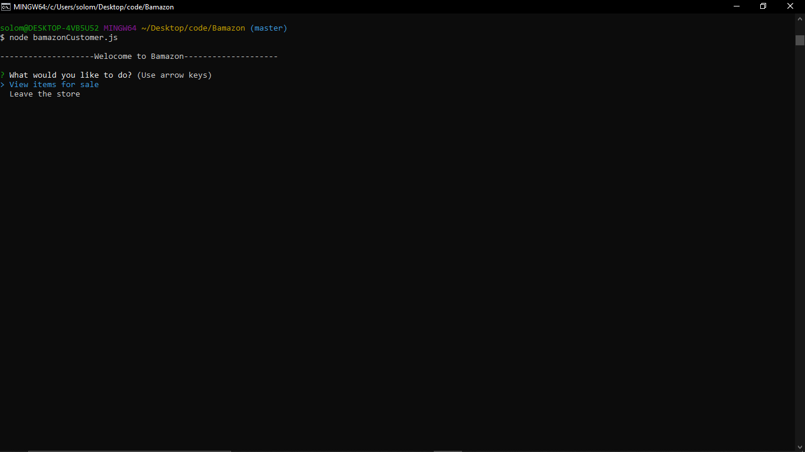
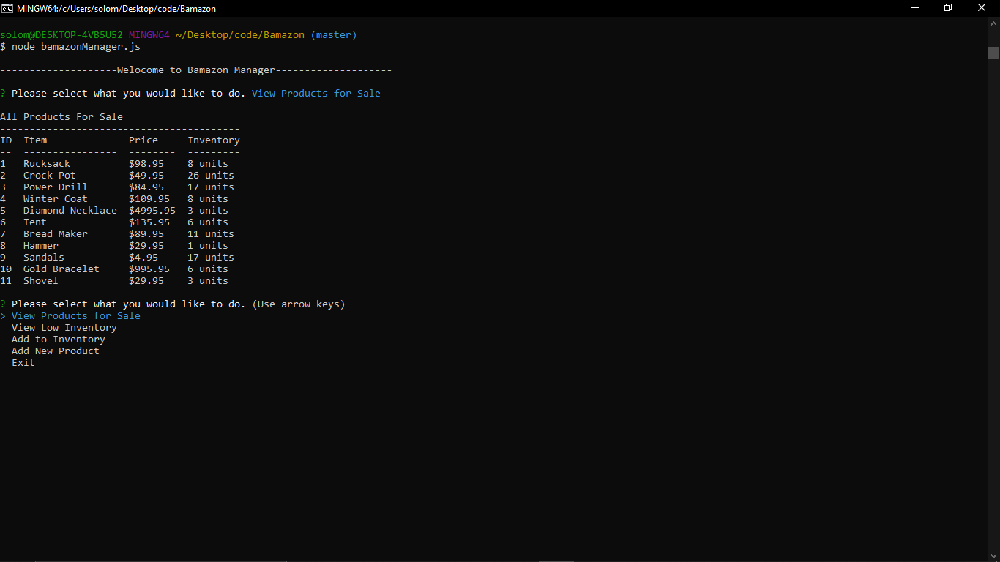

# Bamazon
Bamazon is a Amazon like storefront buitl with MySQL and Node.js.

Within the cutsomer portal (bamazonCustomer.js) you'll be able to:

- View items for sale
- Select the item and quantity of the item you'd like to purchase
- Notify you if there's insufficient invemtory to fill order requests.

Within the manager portal (bamazonManager.js) you'll be able to:

- View all inventory in the store
- View items with low inventory (less than five remaining)
- Add inventory
- Add new items

## Customer Portal (bamazonCustomer.js)

### Welcome to Bamazon Customer



### Making a purchase and leaving the store


## Manager Portal (bamazonManager.js)

### Welcome to Bamazon Manager


### View Products for sale



### View Low Inventory


### Adding Inventory


### Adding New Product


## Installation

To run the app locally, you will first need to git clone the repository to your local machine. 

HTTPS:
````
$ git clone https://github.com/solomangarcia/Bamazon.git
````
SSH:
````
$ git clone git@github.com:solomangarcia/bamazon.git
````

Once cloned, cd into the repository and install the necessary dependencies by running:
````
$ npm install
````

You can then run the app in the customer view by running:
````
$ node bamazonCustomer.js
````

## Built With

* [Node.js](https://nodejs.org/en/) - JavaScript runtime
* [MySQL](https://www.mysql.com/) - Database management
* [npm](https://www.npmjs.com/) - Dependency management

 ## Authors
See contribution history [here](https://github.com/SolomanGarcia/Bamazon/pulse)

## Future Updates
Build out front-end and make bamazon a full-stack app.